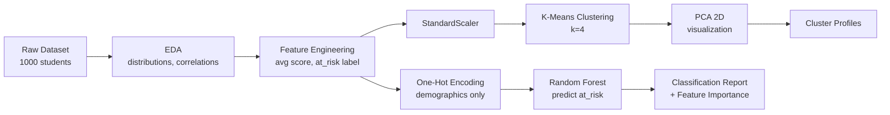

# 🎯 Student Performance & Behavior Analysis

Predicting at-risk students from demographic data alone — without letting the model "see" the exam scores it's trying to predict — and uncovering natural student performance clusters through unsupervised learning.

## 📑 Table of Contents

- [Overview](#-overview)
- [Pipeline](#-pipeline)
- [Dataset](#-dataset)
- [Methodology](#-methodology)
- [Results](#-results)
- [Tech Stack](#%EF%B8%8F-tech-stack)
- [How to Run](#%EF%B8%8F-how-to-run)
- [Limitations & Honest Reflections](#-limitations--honest-reflections)
- [Future Improvements](#-future-improvements)

---

## 📌 Overview

This project asks two questions of the [Students Performance in Exams](https://www.kaggle.com/datasets/spscientist/students-performance-in-exams) dataset (1,000 students, Kaggle):

1. **Can we flag at-risk students using only demographic/background data — before they've taken an exam?**
2. **Do students naturally fall into distinct performance groups, and what do those groups actually look like?**

It combines **supervised classification** and **unsupervised clustering** on the same data, with a specific focus on avoiding a mistake that trips up a lot of beginner ML projects: data leakage.

---

## 🔀 Pipeline



*(Renders as an interactive diagram directly on GitHub — no image file needed.)*

---

## 🗂️ Dataset

| Detail | Value |
|---|---|
| Rows | 1,000 students |
| Features | gender, race/ethnicity, parental level of education, lunch type, test preparation course, math/reading/writing scores |
| Missing values | None |
| Source | Kaggle — Students Performance in Exams |

---

## 🔬 Methodology

<details>
<summary><strong>1. Exploratory Data Analysis (EDA)</strong> — click to expand</summary>

- Verified no missing values, checked data types
- Visualized score distributions for math, reading, and writing
- Compared average scores by test-preparation status and lunch type
- Correlation heatmap across the three subject scores

**Finding:** students who completed test prep averaged **69.7** in math vs **64.1** for those who didn't. Lunch type showed an even bigger gap: **70.0** (standard) vs **58.9** (free/reduced).
</details>

<details>
<summary><strong>2. Feature Engineering</strong> — click to expand</summary>

- Created `average_score`, `total_score`, and `score_std` (consistency across subjects)
- Defined target label: `at_risk = 1` if `average_score < 60`
- Resulting split: **715 Not At Risk / 285 At Risk** — a real class imbalance, addressed below
- One-hot encoded all categorical columns with `drop_first=True` to avoid the dummy variable trap
</details>

<details>
<summary><strong>3. Supervised Learning — Random Forest</strong> — click to expand</summary>

**Goal:** predict `at_risk` using *demographic features only.*

> ⚠️ Exam scores were **deliberately excluded** from the model inputs. Since `at_risk` is derived directly from those scores, including them would let the model "see the answer" — classic data leakage. All score-derived columns are dropped before training.

- 800/200 train/test split, stratified to preserve class balance
- `RandomForestClassifier(n_estimators=100, max_depth=5)`
- Evaluated with a full precision/recall/F1 report + feature importance ranking
</details>

<details>
<summary><strong>4. Unsupervised Learning — K-Means</strong> — click to expand</summary>

- Standardized the three score columns (K-Means is distance-based — scaling is required)
- Used the elbow method to select **k = 4**
- Visualized clusters in 2D with PCA (used *only* for visualization, not as a model input)
- Profiled each cluster's average scores to interpret the groups
</details>

---

## 📊 Results

**Classification Report (Random Forest, demographic features only):**

| Class | Precision | Recall | F1-score | Support |
|---|---|---|---|---|
| Not At Risk | 0.76 | 0.95 | 0.84 | 143 |
| At Risk | 0.67 | **0.25** | 0.36 | 57 |
| **Accuracy** | | | **0.75** | 200 |

The model catches Not-At-Risk students well but **misses 75% of the actual at-risk students** (low recall on the minority class) — a direct consequence of the 715/285 class imbalance. This is flagged honestly below rather than hidden behind the headline 75% accuracy.

**K-Means Cluster Profiles (average scores):**

| Cluster | Students | Math | Reading | Writing | Avg Score |
|---|---|---|---|---|---|
| 1 (Low) | 159 | 44.5 | 47.0 | 44.6 | 45.4 |
| 0 (Below Avg) | 299 | 59.2 | 61.9 | 60.9 | 60.7 |
| 2 (Above Avg) | 356 | 71.4 | 74.9 | 74.0 | 73.4 |
| 3 (High) | 186 | 85.5 | 88.8 | 88.2 | 87.5 |

---

## 🛠️ Tech Stack

Python · pandas · NumPy · matplotlib · seaborn · scikit-learn (`RandomForestClassifier`, `KMeans`, `PCA`, `StandardScaler`)

---

## ▶️ How to Run

```bash
git clone https://github.com/Hitexa-17/student-performance-analysis.git
cd student-performance-analysis
pip install pandas numpy matplotlib seaborn scikit-learn jupyter
jupyter notebook Student_Performance_Analysis.ipynb
```

---

## ⚠️ Limitations & Honest Reflections

- **Class imbalance hurt recall.** With only 285/1000 students labeled at-risk, the model defaults toward predicting "not at risk" — recall of 0.25 on the At Risk class means most genuinely at-risk students were missed. Techniques like class weighting, SMOTE oversampling, or adjusting the decision threshold would directly address this.
- **The 60-point threshold for `at_risk` is a reasonable round number, not a validated cutoff** — a production version should tie this to an actual academic standard.
- **K-Means clusters mostly reflect overall score level**, since the three score columns are highly correlated — the clusters read as "low/below-avg/above-avg/high performers" rather than more nuanced behavioral archetypes. A richer feature set would likely produce more interesting groups.
- **Fairness concern:** the classifier uses `race/ethnicity` and `parental level of education` to predict "at-risk" status. Any real deployment of a model like this risks encoding and reinforcing demographic bias rather than identifying genuine individual need. Before this informs any real decision, I'd want to audit performance across subgroups and seriously consider dropping sensitive attributes entirely.

---

## 📈 Future Improvements

- Address class imbalance (class weighting / SMOTE / threshold tuning) to improve at-risk recall
- Hyperparameter tuning via `GridSearchCV` with cross-validation
- Fairness audit across demographic subgroups
- Compare against Logistic Regression / XGBoost baselines
- Deploy as an interactive Streamlit dashboard

---

**Author:** Hitexa Patel — [LinkedIn](https://www.linkedin.com/in/patel-hitexa-cs2027) · [GitHub](https://github.com/Hitexa-17)


